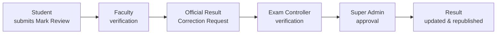
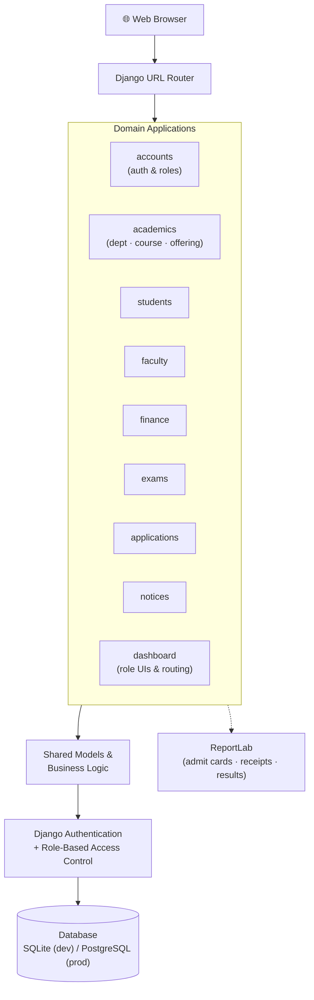
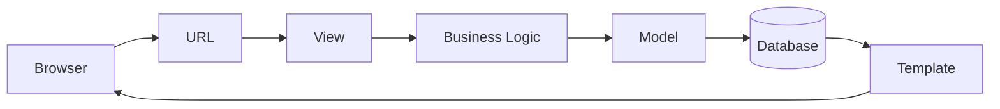
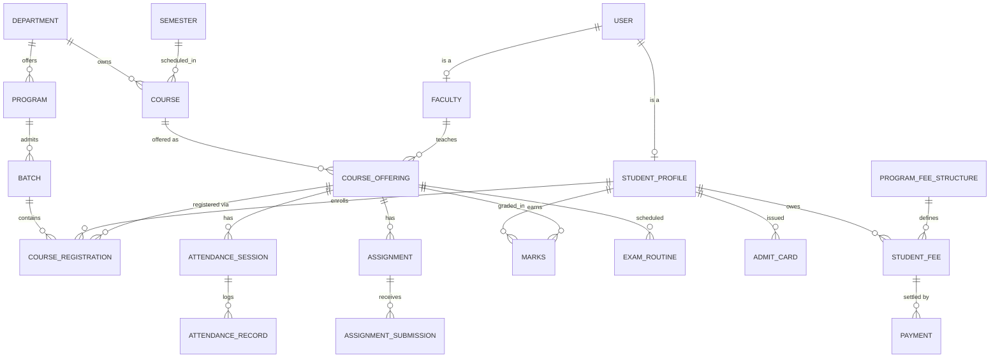
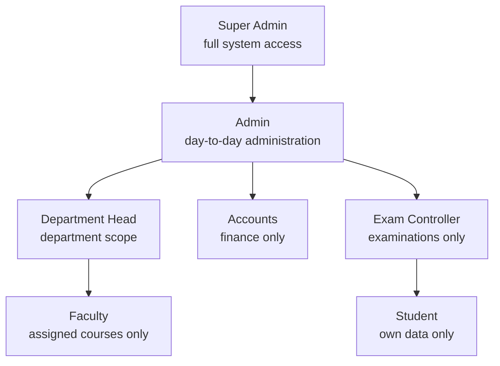

# 🎓 Smart University Portal

**A full-stack University ERP system built with Django — digitizing the complete academic and administrative lifecycle of a modern university.**

[](https://www.python.org/)
[](https://www.djangoproject.com/)
[](https://tailwindcss.com/)
[](LICENSE)
[](docs/15_Project_Roadmap.md)

[Overview](#-overview) •
[Features](#-features) •
[Architecture](#-architecture) •
[Database Design](#-database-design) •
[Roles & Permissions](#-user-roles--permissions) •
[Getting Started](#-getting-started) •
[Documentation](#-documentation) •
[Roadmap](#-roadmap)

</div>

---

## 📖 Overview

**Smart University Portal** is an Enterprise Resource Planning (ERP) system being developed for the **University of Global Village (UGV)**. Rather than a simple student management tool, it aims to replicate how a real university actually operates — bringing academics, finance, examinations, faculty operations, student services, and administration into a single, connected platform.

The project follows a **modular monolith** architecture: every domain (students, faculty, finance, exams, etc.) lives in its own Django app with its own models, views, templates, and URLs, while sharing a common academic data backbone (`Department → Program → Batch → Semester → Course → Course Offering`).

| | |
|---|---|
| **Architecture** | Modular monolith (Django apps per domain) |
| **Rendering** | Server-side (Django Templates + Tailwind CSS) |
| **User Roles** | 7 role-based dashboards |
| **Django Apps** | 9 (`accounts`, `academics`, `students`, `faculty`, `exams`, `finance`, `notices`, `applications`, `dashboard`) |
| **Status** | Active development — roadmap in [`docs/15_Project_Roadmap.md`](docs/15_Project_Roadmap.md) |

---

## ✨ Features

<table>
<tr>
<td valign="top" width="50%">

### 🎓 Student Portal
- Personal dashboard & profile
- Course registration
- Current & previous semester courses
- Attendance tracking
- Assignment submission
- Marks, GPA & semester results
- Exam routine & seat plan
- Admit card download (PDF)
- Finance: payments, dues, waivers, receipts
- Applications to Faculty / Dept. Head / Accounts / Exam Controller
- Mark review requests

### 👨‍🏫 Faculty Portal
- Assigned course offerings
- Attendance sessions & records
- Assignment creation, review & grading
- Marks entry & submission
- Course material uploads
- Hall duty schedule
- Mark review verification
- Result correction request creation

</td>
<td valign="top" width="50%">

### 🏢 Department Head Portal
- Faculty & student monitoring
- Department-level academic overview
- Course enrollment monitoring
- Department reports

### 🏛️ Exam Controller Portal
- Exam routine creation & publishing
- Seat plan generation
- Hall duty assignment
- Admit card eligibility & publishing
- Result publishing & correction workflow
- Exam committee review

### 💰 Finance Module
- Program fee structures
- Student financial profiles
- Payments, receipts & waivers
- Due management & reports
- Bulk student upload

### ⚙️ Administration
- User & role management
- Academic setup (departments, batches, semesters, courses, offerings)
- System settings & notices
- Audit logs

</td>
</tr>
</table>

### 🔁 Signature Workflow — Result Correction

A concrete example of how the system models a real institutional process end-to-end:



---

## 🏗 Architecture



**Request flow** — every module follows the same, template-only path (no business logic in templates):



### Technology Stack

| Layer | Technology |
|---|---|
| **Backend** | Python, Django, Django ORM |
| **Frontend** | HTML5, Django Template Engine, Tailwind CSS, JavaScript |
| **Database** | SQLite (development) → PostgreSQL (planned for production) |
| **PDF Generation** | ReportLab — admit cards, payment receipts, result sheets |
| **Auth** | Django Authentication with a custom `User` model + role-based authorization |
| **Build tooling** | PostCSS, Autoprefixer, Tailwind CLI (`package.json`) |
| **Version control** | Git / GitHub |

---

## 🗄 Database Design

Every academic activity is anchored to the `CourseOffering` model — it's the connective tissue between courses, faculty, students, attendance, marks, and exams.



**Core academic hierarchy:**

```
Department → Program → Batch → Semester → Course → Course Offering → { Faculty, Students }
```

**Finance chain:** `Program Fee Structure → Student Financial Profile → Student Fee → Payment → Receipt`
**Examination chain:** `Exam Routine → Seat Plan → Hall Duty → Admit Card → Result Publication`

Students never link directly to a `Course` — they link through **Course Registration → Course Offering**, which is what allows multiple sections, retakes, and repeated semesters to coexist cleanly. Full model-by-model detail lives in [`docs/02_Database_Design.md`](docs/02_Database_Design.md).

---

## 👥 User Roles & Permissions

The portal is built around **Role-Based Access Control (RBAC)** — every user has exactly one role, and sees only the dashboard and data relevant to it.



| Role | Scope | Can't do |
|---|---|---|
| **Super Admin** | Full CRUD across every module, system configuration | — |
| **Admin** | Academic & student management, courses, batches, notices | System-level configuration |
| **Department Head** | Faculty/student monitoring & reports for their department | Modify other departments |
| **Faculty** | Attendance, assignments, marks, materials for *their own* course offerings | Touch another faculty member's courses |
| **Accounts** | Payments, receipts, waivers, dues, financial reports | Marks, attendance, courses |
| **Exam Controller** | Exam routine, seat plans, hall duty, admit cards, publish results | Edit submitted marks |
| **Student** | Self-service: courses, attendance, results, payments, applications | Access another student's data |

Permissions are enforced at multiple layers: `login_required` decorators, per-view role checks, object-ownership checks (e.g. a faculty member can only touch their own `CourseOffering`), and CSRF/ORM protection against injection. Full breakdown in [`docs/03_User_Roles.md`](docs/03_User_Roles.md).

---

## 📂 Project Structure

```
University-Portal/
├── accounts/          # Custom User model, authentication, roles
├── academics/         # Departments, programs, batches, semesters, courses, offerings
├── students/          # Student profiles, academic records
├── faculty/            # Faculty profiles, teaching assignments
├── exams/              # Exam routine, seat plans, hall duty, admit cards, results
├── finance/            # Fee structures, student fees, payments, waivers
├── notices/            # University-wide announcements
├── applications/       # Student → staff application workflow
├── dashboard/           # Role-based dashboards, view_modules/, shared URLs
│   └── view_modules/    # Views split by domain (academic, faculty, exam_controller, ...)
├── config/              # Django project settings, URLs, WSGI/ASGI
├── templates/            # Server-rendered HTML (base + per-role dashboards)
├── static/               # CSS, JS, images
├── docs/                  # 20+ living design & architecture documents
└── manage.py
```

**Scale at a glance:** 9 Django apps · ~19,000 lines of Python · 75 templates · 36 migrations.

---

## 🚀 Getting Started

### Prerequisites
- Python 3.10+
- pip / virtualenv
- Node.js (only needed if you want to rebuild the Tailwind CSS bundle)

### Installation

```bash
# 1. Clone the repository
git clone https://github.com/fahimroy22/University-Portal.git
cd University-Portal

# 2. Create and activate a virtual environment
python -m venv venv
source venv/bin/activate      # Windows: venv\Scripts\activate

# 3. Install backend dependencies
pip install django reportlab

# 4. (Optional) Install frontend tooling for Tailwind CSS
npm install

# 5. Apply migrations
python manage.py migrate

# 6. Create a superuser (for the Super Admin dashboard)
python manage.py createsuperuser

# 7. Run the development server
python manage.py runserver
```

Then visit `http://127.0.0.1:8000/` and log in with the account you created (or a seeded role account, if you've loaded the mock institutional dataset described in [`docs/14_Test_Data.md`](docs/14_Test_Data.md)).

> **Note:** this repository doesn't yet ship a `requirements.txt` / `package-lock`-equivalent pin file for Python — the project currently only depends on **Django** and **ReportLab** beyond the standard library. Freezing these with `pip freeze > requirements.txt` once versions stabilize is tracked as a housekeeping item.

### Configuration notes
- `DEBUG = True` and the database is **SQLite** by default — both are development-only settings; switch to PostgreSQL and `DEBUG = False` with a real `SECRET_KEY` before any production deployment.
- The custom user model is `accounts.User` (`AUTH_USER_MODEL`), with `role` as its central RBAC field.

---

## 📚 Documentation

This project treats documentation as a first-class citizen — every module has a living design doc under [`docs/`](docs/):

| Doc | Covers |
|---|---|
| [00_Project_Overview](docs/00_Project_Overview.md) | Vision, objectives, scope |
| [01_System_Architecture](docs/01_System_Architecture.md) | Full software architecture |
| [02_Database_Design](docs/02_Database_Design.md) | Models & relationships |
| [03_User_Roles](docs/03_User_Roles.md) | Role permissions |
| [04_UI_Guidelines](docs/04_UI_Guidelines.md) | Design language |
| [05–13] | Per-portal deep dives (Admin, Academic Setup, User Mgmt, Finance, Student, Faculty, Dept. Head, Exam Controller, Results) |
| [14_Test_Data](docs/14_Test_Data.md) | Mock institutional dataset |
| [15_Project_Roadmap](docs/15_Project_Roadmap.md) | Phased future plans |
| [16_Deployment_and_Operations](docs/16_Deployment_and_Operations.md) | Deployment guide |
| [17_API_and_URL_Reference](docs/17_API_and_URL_Reference.md) | URL map & future REST API |
| [18_Management_Commands](docs/18_Management_Commands.md) | Django management commands |
| [19_Known_Issues](docs/19_Known_Issues.md) | Bugs & pending fixes |
| [20_Development_Workflow](docs/20_Development_Workflow.md) | Contribution conventions |

---

## 🗺 Roadmap

Estimated overall completion: **~70%**

- [x] Project structure, authentication, RBAC
- [x] Academic setup, student registration, faculty assignment
- [x] Finance infrastructure (fees, payments, waivers, receipts)
- [x] Examination infrastructure (routine, seat plan, admit cards)
- [ ] Attendance system *(open)*
- [ ] Result generation & transcripts *(open)*
- [ ] Payment gateway integration
- [ ] REST API layer (for a planned mobile app)
- [ ] Notification center & email service
- [ ] Dark mode, analytics, audit log viewer

Long-term vision includes an Android app, AI academic advisor, LMS integration, library & hostel management, and an alumni portal. Full detail in [`docs/15_Project_Roadmap.md`](docs/15_Project_Roadmap.md).

---

## 🖼 Screenshots


---

## 🤝 Contributing

Contributions should follow the conventions in [`docs/20_Development_Workflow.md`](docs/20_Development_Workflow.md) and [`docs/CONTRIBUTING.md`](docs/CONTRIBUTING.md) — keep workflows realistic, update the relevant `docs/` file alongside any code change, and log major changes in [`docs/CHANGELOG.md`](docs/CHANGELOG.md).

---

## 👤 Author

**Fahim Ahmed**
B.Sc. in Computer Science & Engineering — University of Global Village
Full-Stack Developer

## 📄 License

Licensed under the [MIT License](LICENSE).
